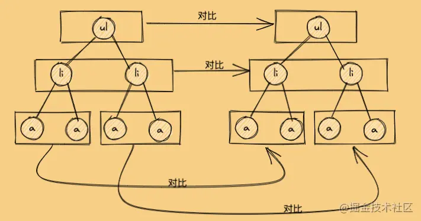
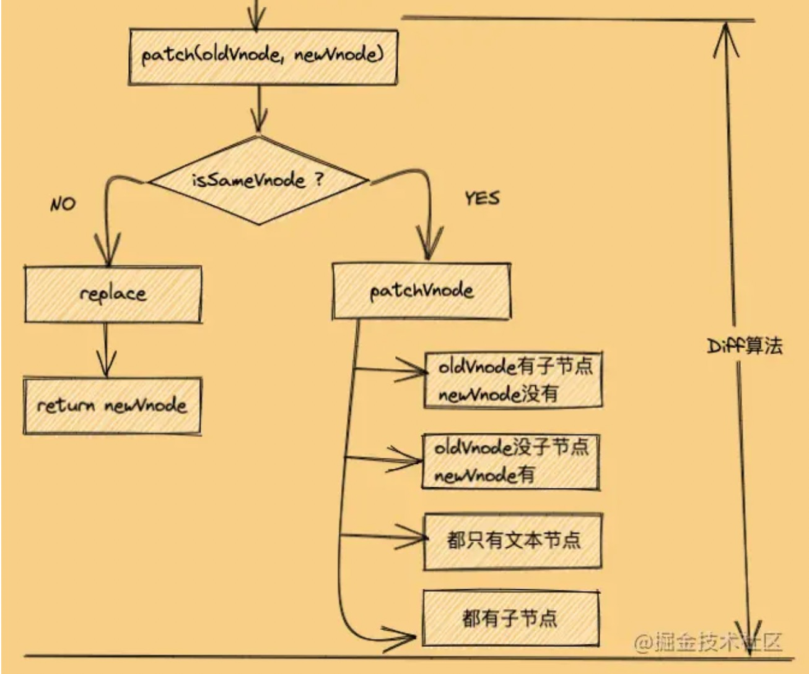

## 一、简答题

### 1、当我们点击按钮的时候动态给 data 增加的成员是否是响应式数据，如果不是的话，如何把新增成员设置成响应式数据，它的内部原理是什么。

```js
let vm = new Vue({
 el: '#el'
 data: {
  o: 'object',
  dog: {}
 },
 method: {
  clickHandler () {
   // 该 name 属性是否是响应式的
   this.dog.name = 'Trump'
  }
 }
})
```

 不是。

如果需将新增的成员设置为响应式对象，有以下两种方式：

1. 通过 Vue 提供的 `$set` 方法，`this.$set(this.dog, 'name', 'Trump')`；
2. 将 `dog` 属性，整体重新赋值，`this.dog = { name: 'Trump' }`。

其原因是，Vue 在初次渲染的时候， 会将 `data` 下的属性，通过 ` Object.defineProperty` 进行依赖的收集，当对应的值发生变化时，会通过 `notify` 发送通知，然后使对应的视图发生变化。

直接通过增加新成员的方式，由于未进行依赖的收集，则在其发生变化时，无法发送对应的通知，因此此时不为响应式数据。

以上两种方式，则会进行依赖的再收集，因此此时则为响应式数据。

　


### 2、请简述 Diff 算法的执行过程

首先，新旧 Vnode 对比的时候，Diff 算法比较只会在同层级进行, 不会跨层级比较。



#### Diff 对比流程

diff 流程可用以下示意图表示：




- 判断新旧节点是否为相同节点（判断依据为新旧节点 key 属性与 sel 属性是否相同），如果相同进行以下比较：
  1. 判断新节点是否有 text 属性，且不等于旧节点的 text 属性时：
     1. 当旧节点含有 children 属性时，则移除旧节点对应的 DOM 元素。
     2. 将新节点对应的 DOM 元素的 textContet 属性设置为 新节点的 text 属性。
  2. 判断新旧节点是否具有 children 属性，并且不相等时，调用 updateChildren 方法，进行 children 节点的比较。
  3. 当只有新节点具有 children 属性时：
     1. 如果老节点具有 text 属性，清空对应元素的 textContet 属性。
     2. 将新节点转化为对应的 DOM 元素，添加到 DOM 树上。
  4. 当只有老节点具有 children 属性时，从 DOM 树上移除对应的 DOM 元素。
  5. 当只有老节点具有 text 属性，清空对应 DOM 元素的 textContent。
- 如果不为相同节点，将新节点通过 createElm 方法，转化成对应的 DOM 元素插入到 DOM 树后，将旧节点对应的 DOM 元素从 DOM 树上移除。

#### 　updateChildren 流程

1. 在对开始节点与结束节点比较的时候，总共有四种对比情况：
   - oldStartVnode 与 newStartVnode 比较
   - oldEndVnode 与  newEndVnode 比较
   - oldStartVnode 与 newEndVnode 比较
   - oldEndVnode 与 newStartVnode 比较
2. 如果新旧开始节点是 sameVnode
   1. 调用 patchVnode () 对比和更新节点
   2. 把旧开始和新开始索引往后移动（oldStartIdx++ / newStartIdx++）
3. 如果新旧结束节点是 sameVnode
   1. 调用 patchVnode () 对比和更新节点
   2. 把旧结束和新结束索引往前移动（oldEndIdx-- / newEndIdx--）
4. 如果旧开始节点与新结束节点是 sameVnode
   1. 调用 patchVnode () 对比和更新节点
   2. 将 oldStartVnode 对应的 DOM 元素，移动到右边，更新索引（oldStartIdx++ / newEndIdx--）
5. 如果新结束节点与旧开始节点是 sameVnode
   1. 调用 patchVnode () 对比和更新节点
   2. 将 oldEndVnode 对应的 DOM 元素，移动到左边，更新索引（oldEndIdx-- / newStartIdx ++）
6. 非以上四种情况 
   - 遍历新节点，从旧节点中依次查找 与之相同的节点
     - 找到相同节点，将旧 sameVnode 节点移动到指定位置
     - 未找到相同节点，在指定位置插入新节点

7. 循环结束
   - 当老节点的所有子节点线遍历完（oldStartIdx >  oldEndIdx），循环结束
   - 当新节点的所有子节点线遍历完（newStartIdx >  newEndIdx），循环结束
8. 如果老节点的数组先遍历完（oldStartIdx > oldEndIdx）
   - 说明新节点有剩余，把剩余节点批量插入到右边
9. 如果新节点的数组先遍历完（newStartIdx > newEndIdx）
   - 说明旧节点有剩余，把剩余节点移除 

　

## 二、编程题

### 1、模拟 VueRouter 的 hash 模式的实现，实现思路和 History 模式类似，把 URL 中的 # 后面的内容作为路由的地址，可以通过 hashchange 事件监听路由地址的变化。

[实现](https://github.com/Atlanstis/lagou-e-task/tree/master/part3/fed-e-task-03-01/1.vue-router)　

　

### 2、在模拟 Vue.js 响应式源码的基础上实现 v-html 指令，以及 v-on 指令。

[实现](https://github.com/Atlanstis/lagou-e-task/tree/master/part3/fed-e-task-03-01/2.%E5%93%8D%E5%BA%94%E5%BC%8F%E5%8E%9F%E7%90%86) 　

　

### 3、参考 Snabbdom 提供的电影列表的示例，利用Snabbdom 实现类似的效果，如图：


[实现](https://github.com/Atlanstis/lagou-e-task/tree/master/part3/fed-e-task-03-01/3.snabbdom)

