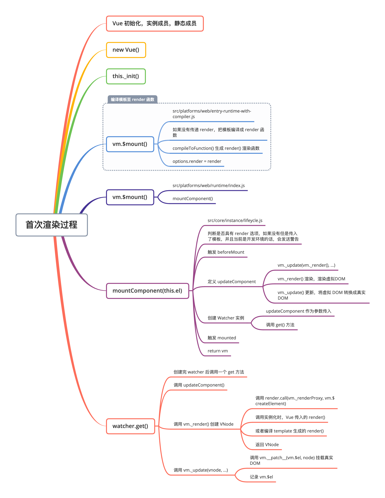
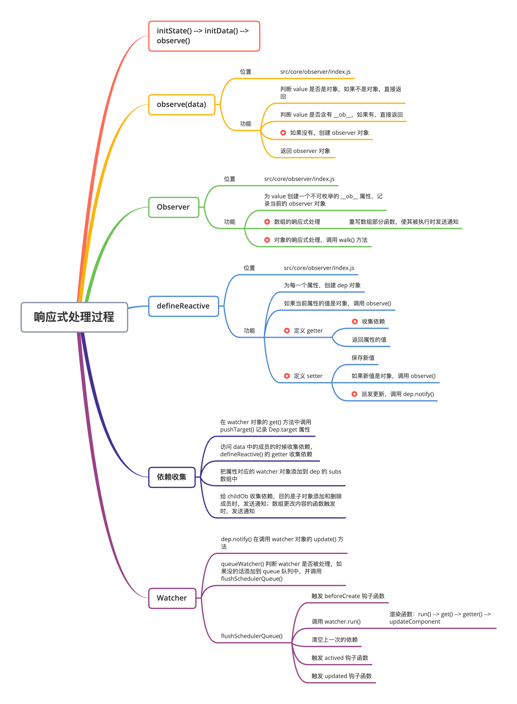
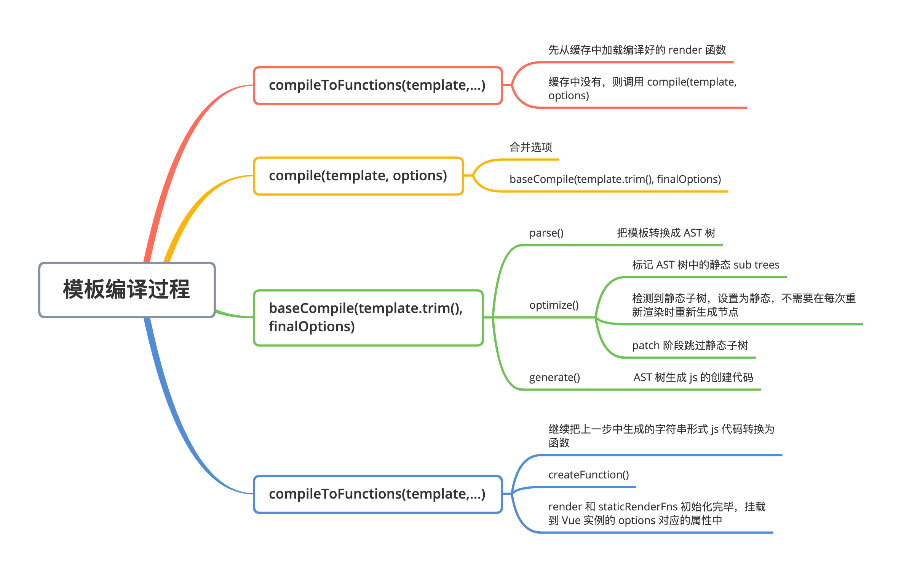

## Vue.js 源码剖析-响应式原理、虚拟 DOM、模板编译和组件化

### 简答题

#### 1、请简述 Vue 首次渲染的过程。



1. 首先进行 Vue 的初始化工作，包括 Vue 的静态成员及实例成员。

   在 src/platforms/web/runtime/index.js 下，处理了与平台相关的函数。

   - 注册和平台相关的全局指令：v-model、v-show
   - 注册和平台相关的全局组件： v-transition、v-transition-group
   - 全局方法：
     - _patch__：把虚拟 DOM 转换成真实 DOM
     - $mount：挂载方法

   ```js
   // src/platforms/web/runtime/index.js
   
   // 判断是否是关键属性（表单元素的 input/checked/selected/muted）
   // 如果是这些属性，设置 el.props 属性（属性不设置到标签上）
   Vue.config.mustUseProp = mustUseProp
   Vue.config.isReservedTag = isReservedTag
   Vue.config.isReservedAttr = isReservedAttr
   Vue.config.getTagNamespace = getTagNamespace
   Vue.config.isUnknownElement = isUnknownElement
   
   // 注册 指令 v-model、v-show
   extend(Vue.options.directives, platformDirectives)
   // 注册 组件 transition、transition-group
   extend(Vue.options.components, platformComponents)
   
   Vue.prototype.__patch__ = inBrowser ? patch : noop
   
   Vue.prototype.$mount = function (
     el?: string | Element,
     hydrating?: boolean
   ): Component {
     el = el && inBrowser ? query(el) : undefined
     return mountComponent(this, el, hydrating)
   }
   ```

   在 src/core/index.js 下，通过 initGlobalAPI 方法，给 Vue 的构造函数增加了静态方法，包括单不限于

   - set，delete，nextTick
   - observable
   - 初始化 Vue.options 对象，并拓展 components/directives/filters
   - 设置 keep-alive 组件
   - 注册 Vue.use() 用来注册插件
   - 注册 Vue.mixin()
   - 注册 Vue.extend() 基于传入的 options 返回一个组件的构造函数
   - 注册 Vue.directive()、Vue.component()、Vue.filter()

   ```js
   export function initGlobalAPI (Vue: GlobalAPI) {
     // config
     const configDef = {}
     configDef.get = () => config
     // ...
     // 初始化 Vue.config 对象
     Object.defineProperty(Vue, 'config', configDef)
   
     // exposed util methods.
     // NOTE: these are not considered part of the public API - avoid relying on
     // them unless you are aware of the risk.
     // 这些工具方法不视作全局 API 的一部分，除非你已经意识到某些风险，否则不要去依赖它们
     Vue.util = {
       warn,
       extend,
       mergeOptions,
       defineReactive
     }
   
     // 静态方法 set/del/nextTick
     Vue.set = set
     Vue.delete = del
     Vue.nextTick = nextTick
   
     // 2.6 explicit observable API
     // 让一个对象可响应
     Vue.observable = <T>(obj: T): T => {
       observe(obj)
       return obj
     }
     
     // 初始化 Vue.options 对象，并给其拓展
     // components/directives/filters
     Vue.options = Object.create(null)
     ASSET_TYPES.forEach(type => {
       Vue.options[type + 's'] = Object.create(null)
     })
   
     // this is used to identify the "base" constructor to extend all plain-object
     // components with in Weex's multi-instance scenarios.
     Vue.options._base = Vue
   
     // 设置 keep-alive 组件
     extend(Vue.options.components, builtInComponents)
   
     // 注册 Vue.use() 用来注册插件
     initUse(Vue) 实现混入
     // 注册 Vue.mixin()
     initMixin(Vue)
     // 注册 Vue.extend() 基于传入的 options 返回一个组件的构造函数
     initExtend(Vue)
     // 注册 Vue.directive()、Vue.component()、Vue.filter()
     initAssetRegisters(Vue)
   }
   ```

   在 src/core/instance/index.js 下，定义了 Vue 的构造函数，给 Vue 中混入了常用的实例成员，包括但不限于

   - 注册 vm 的 _init 方法，初始化 vm
   - 注册 vm 的 $data/$props/$set/$delete/$watch
   - 初始化事件相关方法，$on/$off/$once/$emit
   - 初始化生命周期相关的混入方法，_update/$forceUpdate/$destroy
   - 混入 render：$nextTick/_render

   ```js
   // src/core/instance/index.js
   
   // 此处不用 class 的原因是因为方便后续给 Vue 实例混入实例变量
   function Vue (options) {
     // ...
     // 调用 _init 方法
     this._init(options)
   }
   
   // 注册 vm 的 _init 方法，初始化 vm
   initMixin(Vue)
   // 注册 vm 的 $data/$props/$set/$delete/$watch
   stateMixin(Vue)
   // 初始化事件相关方法
   // $on/$off/$once/$emit
   eventsMixin(Vue)
   // 初始化生命周期相关的混入方法
   // _update/$forceUpdate/$destroy
   lifecycleMixin(Vue)
   // 混入 render
   // $nextTick/_render
   renderMixin(Vue)
   ```

2. 调用 new Vue() 进行实例的创建，在其构造函数中，调用 this._init()方法，对各种配置参数进行处理。

   - 将用户传入的配置跟基础配置进行合并。
   - 初始化生命周期，事件，各项数据，并且在相应的阶段触发相应钩子函数的回调。
   - 调用 $mount，挂载到 DOM 树上。

   ```js
   Vue.prototype._init = function (options?: Object) {
     // ...
     // // 合并 options
     vm.$options = mergeOptions(
       resolveConstructorOptions(vm.constructor),
       options || {},
       vm
     )
     // ...
     // 初始化操作
     vm._self = vm
     // vm 的生命周期相关变量初始化
     // #children/$parent/$root/$refs
     initLifecycle(vm)
     // vm 的事件监听初始化，父组件绑定在当前组件上的事件
     initEvents(vm)
     // vm 的编译 render 初始化
     // $slots/$socpedSlots/_c/$createElement/$attrs/$listener
     initRender(vm)
     // beforeCreate 钩子的回调
     callHook(vm, 'beforeCreate')
     // 把 inject 的成员注入到 vm 上
     initInjections(vm) // resolve injections before data/props
     // 初始化 vm 的 _props/methods/_data/computed/watch
     initState(vm)
     // 初始化 provide
     initProvide(vm) // resolve provide after data/props
     // create 钩子的回调 
     callHook(vm, 'created')
     
     // 调用 $mounted() 挂载
     if (vm.$options.el) {
       vm.$mount(vm.$options.el)
     }
   }
   ```

3. 针对 编辑器 + 运行时 版本，在 src/platforms/web/entry-runtime-with-compiler.js 下，进行了额外处理。

   首先缓存了 vue 实例的 $mount 方法，之后针对 template / el 及 render 等参数进行处理。

   - el 不能是 body 或者 html 标签。
   - 如果没有 render 函数，把 template / el 通过 compileToFunctions 函数转换成 render 函数。
   - 如果有 render 函数，直接调用 mount 挂载 DOM。

   ```js
   // src/platforms/web/entry-runtime-with-compiler.js
   
   // 保留 Vue 实例的 $mount 方法
   const mount = Vue.prototype.$mount
   Vue.prototype.$mount = function (
     el?: string | Element,
     // 非 ssr 情况下为 false，ssr 时候为 true
     hydrating?: boolean
   ): Component {
     // 获取 el 对象
     el = el && query(el)
   
     /* istanbul ignore if */
     // el 不能为 body 或者 html
     if (el === document.body || el === document.documentElement) {
       // ...
       return this
     }
   
     const options = this.$options
     // resolve template/el and convert to render function
     // 把 template/el 转换成 render 函数
     if (!options.render) {
       let template = options.template
       // 如果模板存在
       if (template) {
         if (typeof template === 'string') {
           // 如果模板是 id 选择器
           if (template.charAt(0) === '#') {
             // 获取对应的 DOM 对象的 innerHTML
             template = idToTemplate(template)
             // ...
           }
         } else if (template.nodeType) {
           // 如果模板是元素，返回元素的 innerHTML
           template = template.innerHTML
         } else {
           if (process.env.NODE_ENV !== 'production') {
             warn('invalid template option:' + template, this)
           }
           return this
         }
       } else if (el) {
         template = getOuterHTML(el)
       }
       if (template) {
   			// ...
   
         const { render, staticRenderFns } = compileToFunctions(template, {
           outputSourceRange: process.env.NODE_ENV !== 'production',
           shouldDecodeNewlines,
           shouldDecodeNewlinesForHref,
           delimiters: options.delimiters,
           comments: options.comments
         }, this)
         options.render = render
         options.staticRenderFns = staticRenderFns
   
        	// ...
       }
     }
     // 调用 mount 方法，渲染 DOM
     return mount.call(this, el, hydrating)
   }
   ```
   
4. $mount 方法，本质上调用了 mountComponent 方法。

   ```js
   Vue.prototype.$mount = function (
     el?: string | Element,
     hydrating?: boolean
   ): Component {
     el = el && inBrowser ? query(el) : undefined
     return mountComponent(this, el, hydrating)
   }
   ```

5. 在 mountComponent 中，定义了 updateComponent() 函数但是并未调用，这个函数中调用了 _render() 和 _update() 两个方法，\_render() 是用于生成虚拟 DOM，\_update() 是将虚拟 DOM 转化为真实 DOM 并挂载到 DOM 树上，最终渲染到页面上。

   ```js
   updateComponent = () => {
     vm._update(vm._render(), hydrating)
   }
   ```

6. 创建 Watcher 实例，该实例作为渲染 Watcher，用于与之相关的响应式对象发生变化时，接受通知，调用 updateComponent() 函数进行页面视图的变更。在实例的创建过程中，也会 调用其自身的 get 方法，该方法中也会调用 updateComponent() 函数进行页面视图的首次渲染。

   ```js
   new Watcher(vm, updateComponent, noop, {
     before () {
       if (vm._isMounted && !vm._isDestroyed) {
         callHook(vm, 'beforeUpdate')
       }
     }
   }, true /* isRenderWatcher */)
   ```

7. 触发 mounted 钩子函数后返回当前 vm 实例。

　

#### 2、请简述 Vue 响应式原理。



- Vue2.x 版本的响应式主要是通过 Object.defineProperty() 函数实现的，通过劫持数据 的 getter 与 setter 方法，在第一次访问数据时，进行依赖收集，当数据发生变化时，派发更新，重新渲染视图。

- Vue 的响应式是从Vue的实例的 \_init() 方法中开始的，在  \_init()  方法中先调用 initState() 方法初始化 Vue 实例的状态，在  initState()  方法中调用了 initData() 方法， initData() 方法，是把 data 属性注入到 Vue 实例上，并且调用 observe(data) 方法 将 data 对象转化成响应式的对象。

  ```js
  function initData (vm: Component) {
    let data = vm.$options.data
    // 初始化 _data，组件中 data 是函数，调用函数返回结果
    // 否则直接返回 data
    data = vm._data = typeof data === 'function'
      ? getData(data, vm)
      : data || {}
    // ...
    // 响应式处理
    observe(data, true /* asRootData */)
  }
  ```

- observe 方法是响应式的入口， 在 observe(value) 中，首先判断传入的参数 value 是否是对象，如果不是对象直接返回。再判断value 对象是否有 \_\_ob\_\_ 这个属性，存在这个属性，则说明该对象已进行过响应式处理，直接返回；如果没有，以 value 对象作为参数，创建 Observer 实例 ob，并返回实例 ob。

  ```js
  export function observe (value: any, asRootData: ?boolean): Observer | void {
    // 判断 value 是否是对象
    if (!isObject(value) || value instanceof VNode) {
      return
    }
    // ob 为 类 Observer 的一个实例
    let ob: Observer | void
    // 如果 value 有 __ob__ (observer 对象) 属性，结束
    if (hasOwn(value, '__ob__') && value.__ob__ instanceof Observer) {
      // 已声明为响应式数据，返回
      ob = value.__ob__
    } else if (
      shouldObserve &&
      !isServerRendering() &&
      (Array.isArray(value) || isPlainObject(value)) &&
      Object.isExtensible(value) &&
      !value._isVue
    ) {
      // 创建 一个 Observer 对象
      ob = new Observer(value)
    }
    // ...
    return ob
  }
  ```

- 在 Observer 实例创建的过程中，给当前的 value 对象定义不可枚举的\_\_ob\_\_ 属性，记录当前的 observer 对象。然后根据 value 的类型进行不同的响应式处理。

  ```js
  export class Observer {
  	// ... 
    constructor (value: any) {
      this.value = value
      this.dep = new Dep()
      // 初始化实例的 vmCount 为 0
      this.vmCount = 0
      // 将实例挂载到观察对象的 __ob__ 属性
      def(value, '__ob__', this)
      if (Array.isArray(value)) {
        // 数组的响应式处理
        // 判断浏览器是否支持 __proto__
        if (hasProto) {
          protoAugment(value, arrayMethods)
        } else {
          copyAugment(value, arrayMethods, arrayKeys)
        }
        // 为数组中的每一个对象创建一个 observer 实例
        this.observeArray(value)
      } else {
        // 遍历对象的每一个属性，转换成 setter/getter
        this.walk(value)
      }
    }
  
    walk (obj: Object) {
      const keys = Object.keys(obj)
      for (let i = 0; i < keys.length; i++) {
        defineReactive(obj, keys[i])
      }
    }
  
    observeArray (items: Array<any>) {
      for (let i = 0, l = items.length; i < l; i++) {
        observe(items[i])
      }
    }
  }
  ```

  - 当 value 的类型是数组时，会对其数组上的几个原生方法（push，pop，shift，unshift，splice，sort，reverse）进行重新定义（原因是这几个方法会改变数组的数据，但无法触发通知）。之后通过 observeArray() 方法，对每个数组成员执行 observe()，递归使其成为响应式对象。当之前重新定义的方法被触发时，首先会调用去原生方法，获取调用后的值。针对有新数组成员的情况，通过 observeArray()，遍历使其成为响应式对象。 之后获取数组对象中的 \_\_ob\_\_ 对象中的 dep 属性，调用 dep 的 notify() 方法，触发视图的更新。

    ```js
    const arrayProto = Array.prototype
    // 使用数组的原型创建一个新的对象
    export const arrayMethods = Object.create(arrayProto)
    // 修改数组元素的方法
    const methodsToPatch = [
      'push',
      'pop',
      'shift',
      'unshift',
      'splice',
      'sort',
      'reverse'
    ]
    methodsToPatch.forEach(function (method) {
      // cache original method
      // 保存数组的原方法
      const original = arrayProto[method]
      // 调用 Object.defineProperty() 重新定义修改数组的方法
      def(arrayMethods, method, function mutator (...args) {
        // 执行数组的原方法
        const result = original.apply(this, args)
        // 获取数组对象的 ob 对象
        const ob = this.__ob__
        let inserted
        switch (method) {
          case 'push':
          case 'unshift':
            inserted = args
            break
          case 'splice':
            inserted = args.slice(2)
            break
        }
        // 对插入的新元素，重新遍历数组元素设置为响应式数据
        if (inserted) ob.observeArray(inserted)
        // notify change
        // 调用修改数组的方法，调用数组的 ob 对象发送通知
        ob.dep.notify()
        return result
      })
    })
    ```

  - 当 value 的类型是对象时，调用 walk() 方法，遍历对象的每一个属性，对每个属性调用 defineReactive() 方法。

- defineReactive() 会为每一个属性创建一个对应的 dep 对象，让 dep 去收集依赖，如果当前属性的值是对象，会递归调用 observe()，将子对象属性都转换成 getter/setter，返回子观察对象。

  defineReactive() 中最核心的作用是通过 Object.defineProperty() 函数对对象的每个属性设置相应的 getter 与 setter。

  - getter 的作用是进行依赖收集，并返回属性的值。
  - setter 的作用是进行派发更新，并保存新值，当新值为对象时，调用 observe()  方法，观察子对象并返回子的 observer 对象。

  ```js
  // 为一个对象定义一个响应式的属性
  export function defineReactive (
    obj: Object,
    key: string,
    val: any,
    customSetter?: ?Function,
    // 为 true 时，只监听数据的第一层属性
    shallow?: boolean
  ) {
    // 创建依赖对象实例，收集观察对象 key 的所有 watcher
    const dep = new Dep()
    // ...
    // 判断是否递归观察子对象，并将子对象属性都转换成 getter/setter，返回子观察对象
    let childOb = !shallow && observe(val)
    Object.defineProperty(obj, key, {
      enumerable: true,
      configurable: true,
      get: function reactiveGetter () {
        // 如果预定义的 getter 存在，则 value 等于 getter 调用的返回值，否则直接赋值
        const value = getter ? getter.call(obj) : val
        // 如果存在当前依赖目标，即 watcher 对象，则建立依赖
        if (Dep.target) {
          dep.depend()
          // 如果子观察目标存在，建立子对象的依赖关系
          if (childOb) {
            childOb.dep.depend()
            // 如果属性是数组，则特殊处理收集数组对象依赖
            if (Array.isArray(value)) {
              dependArray(value)
            }
          }
        }
        // 返回属性值
        return value
      },
      set: function reactiveSetter (newVal) {
        // 如果预定义的 getter 存在，则 value 等于 getter 调用的返回值，否则直接赋予属性值
        const value = getter ? getter.call(obj) : val
        // 如果新值等于旧值或者新值旧值为 NaN 则不执行
        if (newVal === value || (newVal !== newVal && value !== value)) {
          return
        }
        // 如果只存在 getter，不存在 setter 直接返回
        if (getter && !setter) return
        // 如果预定义 setter 存在则调用，否则直接更新新值
        if (setter) {
          setter.call(obj, newVal)
        } else {
          val = newVal
        }
        // 如果新值是对象，观察子对象并返回子的 observer 对象
        childOb = !shallow && observe(newVal)
        // 派发更新（发送更改通知）
        dep.notify()
      }
    })
  }
  ```

- 收集依赖的过程发生在 Watcher 实例创建的过程中。在 watcher 实例的 get 方法中调用了 pushTarget() 方法，此时会记录 Dep.target 属性。当访问响应式对象中的成员的时候，会进行依赖的收集，此时会触发之前定义的 getter 方法，把属性对应的 watcher 对象添加到 dep 的 subs 数组中。当当前属性的值为对象时，也会对子观察目标 childOb 收集依赖，目的是子对象添加和删除成员时发送通知。

  ```js
  export default class Watcher {
    // ...
    get () {
      pushTarget(this)
      let value
      const vm = this.vm
      try {
        // 渲染 Watcher 此处执行 updateComponent
        value = this.getter.call(vm, vm)
      } catch (e) {
        // ...
      } finally {
        // ...
      }
      return value
    }
  }
  ```

- 当响应式对象发生变化时，会触发定义的 setter方法，在 setter 方法中，会调用dep.notify() 发送通知，dep.notify() 会调用 watcher对象的 update() 方法将更新放入队列中，在恰当的时候执行。执行时，调用 watcher 的 run() 方法。在 run () 方法中，执行 get() 方法，在 get 方法中，调用 updateComponent()，此时会重新生成 VNode，并通过 patch() 函数，将更改后的内容渲染到页面上。

- 最后清空上一次的依赖，并触发钩子函数 actived，updated。


#### 3、请简述虚拟 DOM 中 Key 的作用和好处。

使用 Key 最大的作用是重用 DOM ，减少 DOM 操作。

Key 的使用在函数 sameVnode 中，Key 是判断比较两个 VNode 是否相同的重要依据。

```js
function sameVnode (a, b) {
  return (
    a.key === b.key &&
    // ...
  )
}
```

当页面由于数据的变化发生重新渲染时，此时会重新生成 VNode，Vue 会调用 patch 方法通过对比新、旧节点的变化来更新视图。

如果新旧节点都存在，且旧 VNode 不为真实 DOM，同时通过 sameVnode 函数判断为相同节点，此时就会调用 patchVnode 函数进行 diff 操作，比对新旧节点的差异。

```js
// 新旧 VNode 都存在，更新
const isRealElement = isDef(oldVnode.nodeType)
if (!isRealElement && sameVnode(oldVnode, vnode)) {
  // 旧 VNode 不为真实 DOM，且新旧节点相同
  // 更新操作，diff 算法
  patchVnode(oldVnode, vnode, insertedVnodeQueue, null, null, removeOnly)
}
```

在 patchVnode 函数中，若新节点没有文本，且新节点和旧节点都有子节点，则需对子节点进行 Diff 操作，即调用 updateChildren，Key 就在 updateChildren 起了大作用。

```js
if (isUndef(vnode.text)) {
  // 新节点没有文本
  if (isDef(oldCh) && isDef(ch)) {
    // 新老节点都有子节点
    // 对子节点进行 diff 操作，调用 updateChildren
    if (oldCh !== ch) updateChildren(elm, oldCh, ch, insertedVnodeQueue, removeOnly)
  }
  // ...
}
```

updateChildren 中会遍历对比新、旧节点的子节点，并按 Diff 算法通过 sameVnode 来判断要对比的节点是否相同。

```js
// diff 算法
// 当新节点与旧节点都没有遍历完成
while (oldStartIdx <= oldEndIdx && newStartIdx <= newEndIdx) {
  // ...
  if (sameVnode(oldStartVnode, newStartVnode)) {
    // oldStartVnode 和 newStartVnode 相同
    // 直接将该 VNode 节点进行 patchVnode
    patchVnode(oldStartVnode, newStartVnode, insertedVnodeQueue, newCh, newStartIdx)
    // 获取下一组节点
    oldStartVnode = oldCh[++oldStartIdx]
    newStartVnode = newCh[++newStartIdx]
  } else if (sameVnode(oldEndVnode, newEndVnode)) {
    // oldEndVnode 和 newEndVnode 相同
    // 直接将该 VNode 节点进行 patchVnode
    patchVnode(oldEndVnode, newEndVnode, insertedVnodeQueue, newCh, newEndIdx)
    // 获取下一组节点
    oldEndVnode = oldCh[--oldEndIdx]
    newEndVnode = newCh[--newEndIdx]
  } else if (sameVnode(oldStartVnode, newEndVnode)) { // Vnode moved right
    // oldStartVnode 和 newEndVnode 相同
    // 进行 patchVnode，把 oldStartVnode 移动到最后
    patchVnode(oldStartVnode, newEndVnode, insertedVnodeQueue, newCh, newEndIdx)
    canMove && nodeOps.insertBefore(parentElm, oldStartVnode.elm, nodeOps.nextSibling(oldEndVnode.elm))
    // 移动游标，获取下一组节点
    oldStartVnode = oldCh[++oldStartIdx]
    newEndVnode = newCh[--newEndIdx]
  } else if (sameVnode(oldEndVnode, newStartVnode)) { // Vnode moved left
    // oldEndVnode 和 newStartVnode 相同
    // 进行 patchVnode，把 oldEndVnode 移动到最左
    patchVnode(oldEndVnode, newStartVnode, insertedVnodeQueue, newCh, newStartIdx)
    canMove && nodeOps.insertBefore(parentElm, oldEndVnode.elm, oldStartVnode.elm)
    // 移动游标，获取下一组节点
    oldEndVnode = oldCh[--oldEndIdx]
    newStartVnode = newCh[++newStartIdx]
  } else {
    // 以上四种情况都不满足
    // newStartVnode 依次和旧的节点比较

    // 从新的节点开头获取一个，从老节点中查找相同节点
    // 先找新开始节点的 key 与老节点相同的索引，如果没找到再通过 sameVnode 查找
    if (isUndef(oldKeyToIdx)) oldKeyToIdx = createKeyToOldIdx(oldCh, oldStartIdx, oldEndIdx)
    idxInOld = isDef(newStartVnode.key)
      ? oldKeyToIdx[newStartVnode.key]
      : findIdxInOld(newStartVnode, oldCh, oldStartIdx, oldEndIdx)
      // 如果没有找到
    if (isUndef(idxInOld)) { // New element
      // 创建节点并插入到最前面
      createElm(newStartVnode, insertedVnodeQueue, parentElm, oldStartVnode.elm, false, newCh, newStartIdx)
    } else {
      // 找到
      // 获取要移动的老节点，
      vnodeToMove = oldCh[idxInOld]
      // 如果使用 newStartVnode 找到相同的老节点
      if (sameVnode(vnodeToMove, newStartVnode)) {
        // 执行 patchVnode，并将找到的旧节点移动到最前面
        patchVnode(vnodeToMove, newStartVnode, insertedVnodeQueue, newCh, newStartIdx)
        oldCh[idxInOld] = undefined
        canMove && nodeOps.insertBefore(parentElm, vnodeToMove.elm, oldStartVnode.elm)
      } else {
        // 如果 key 相同，但是是不同的元素，创建新元素
        // same key but different element. treat as new element
        createElm(newStartVnode, insertedVnodeQueue, parentElm, oldStartVnode.elm, false, newCh, newStartIdx)
      }
    }
    newStartVnode = newCh[++newStartIdx]
  }
}
if (oldStartIdx > oldEndIdx) {
  // 当结束时，oldStartIdx > oldEndIdx，旧节点遍历完，但是新节点还没有
  // 说明新节点比老节点多，把剩下的新节点插入到老节点后面
  refElm = isUndef(newCh[newEndIdx + 1]) ? null : newCh[newEndIdx + 1].elm
  addVnodes(parentElm, refElm, newCh, newStartIdx, newEndIdx, insertedVnodeQueue)
} else if (newStartIdx > newEndIdx) {
  // newStartIdx > newEndIdx，新节点遍历完，但是老节点还没有
  // 移除剩余老节点
  removeVnodes(oldCh, oldStartIdx, oldEndIdx)
}
```

在 diff 算法中，会先从新旧节点的首尾两端开始比较，依次向中间靠拢，共分为四种情况。

- 若这里的子节点未设置 Key，则此时的每个新、旧子节点在执行 sameVnode 时会判定相同，然后再次执行一次 patchVnode 来对比这些子节点，假设这些子节点的文本内容不同，此时就会进行 DOM 的操作。
- 若设置了 Key，当执行 sameVnode 进行判定时，
  - 若 Key 不同， sameVnode 返回 false，然后执行后续判断；
  - 若 Key 相同，sameVnode 返回 true，然后再执行 patchVnode 来对比这些子节点。之后节点会发生移位，减少 DOM 的操作。

即，使用了 Key 后，可以优化新、旧节点的对比判断，减少了遍历子节点的层次，少使用很多次 patchVnode，减少 DOM 的操作。

#### 4、请简述 Vue 中模板编译的过程。



模版编译的目的就是将模版 template 转换成渲染函数 render。

- 模板编译是将字符串模板转换成 AST 对象。
- 通过标记静态根节点的方式进行优化 AST 对象，这样在 patch 的时候直接跳过静态内容。
- 优化好的 AST 转换成字符串形式代码，之后通过 new Function() 转换成方法，最终得到 render 函数。

在 compileToFunctions 中，首先从缓存中加载编译好的 render 函数，如在缓存中未找到，则调用 compiled() 进行编译。

```js
return function compileToFunctions (
  template: string,
  options?: CompilerOptions,
  vm?: Component
): CompiledFunctionResult {
  options = extend({}, options)
  const warn = options.warn || baseWarn
  delete options.warn
	// ...
  // 1. 读取缓存中的 CompiledFunctionResult 对象，如果有直接返回
  const key = options.delimiters
    ? String(options.delimiters) + template
    : template
  if (cache[key]) {
    return cache[key]
  }
  // 2. 把模板编译为编译对象（render，staticRenderFns），字符串形式的 js 代码
  const compiled = compile(template, options)
	// ...
  const res = {}
  const fnGenErrors = []
  // 3. 把字符串形式的 js 代码转换成 js 方法
  res.render = createFunction(compiled.render, fnGenErrors)
  res.staticRenderFns = compiled.staticRenderFns.map(code => {
    return createFunction(code, fnGenErrors)
  })
	// ...
  // 缓存并返回 res 对象（render, staticRenderFns 方法）
  return (cache[key] = res)
}
```

在 compiled() 方法中，首先进行合并选项，调用 baseCompile 进行编译，最后记录错误，返回编译好的对象。

```js
const compiled = baseCompile(template.trim(), finalOptions)
```

在 baseCompile 函数将模板编译成 render 函数，主要可分为以下三步：

1. parse：把模板转换成 ast 抽象语法树
2. optimize：优化抽象语法树
   1. 优化抽象语法树，检测子节点中是否是纯静态节点
   2. 一旦检测到纯静态节点（永远不会更改的节点）
      1. 提升为常量，重新渲染的时候不在重新创建节点
      2. 在 patch 的时候直接跳过静态子树
3. generate：把抽象语法树生成字符串形式的 js 代码

最后返回。

```js
export const createCompiler = createCompilerCreator(function baseCompile (
  template: string,
  options: CompilerOptions
): CompiledResult {
  // 把模板转换成 ast 抽象语法树
  // 抽象语法树，用来以树形的方式描述代码结构
  const ast = parse(template.trim(), options)
  if (options.optimize !== false) {
    // 优化抽象语法树
    optimize(ast, options)
  }
  // 把抽象语法树生成字符串形式的 js 代码
  const code = generate(ast, options)
  return {
    ast,
    // 渲染函数
    render: code.render,
    // 静态渲染函数，生成静态 VNode 树 
    staticRenderFns: code.staticRenderFns
  }
})
```

