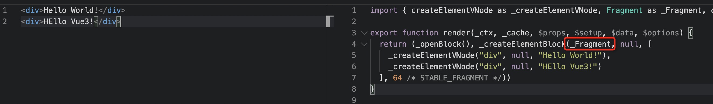
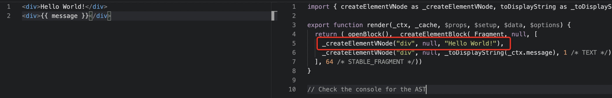
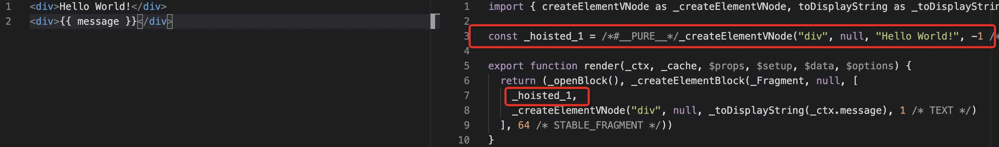
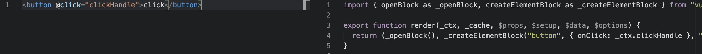
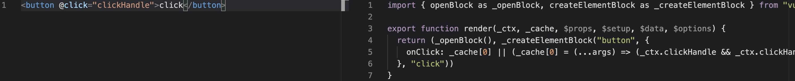

## 简答题

（请直接在本文件中作答）

#### 1、Vue 3.0 性能提升主要是通过哪几方面体现的？

##### 响应式系统升级

vue2 中采用 defineProperty 来劫持整个对象，然后进行深度遍历所有属性，给每个属性添加 getter 和 setter，实现响应式

vue3 采用 proxy 重写了响应式系统，因为 proxy 可以对整个对象进行监听，所以不需要深度遍历

- 可以监听动态属性的添加
- 可以监听到数组的索引和数组 length 属性
- 可以监听删除属性

##### 优化打包体积

- Vue.js 3.0 中移除了一些不常用的 API
  - 例如：inline-template，filter 等
- Tree-shaking
  - 任何一个函数，如 ref、reavtived、computed 等，仅仅在用到的时候才打包，没用到的模块都被去除，打包的整体体积变小

##### 编译优化

- Vue.js 2.x 中通过标记静态根节点，优化 diff 的过程
- Vue.js 3.0 中标记和提升所有的静态根节点，diff 的时候只需要对比动态节点内容
  - Fragments：模板中可以直接放文本内容或同级标签
  - 静态提升：对不参与更新的元素，会做静态提升，只会被创建一次，在渲染时直接复用
  - Patch flag（静态标记）：在动态标签末尾加上相应的标记，只能带 Patch flag 的节点才被认为是动态的元素，会被追踪属性的修改，能快速的找到动态节点,而不用逐个逐层遍历，提高了虚拟 dom diff 的性能
  - 缓存事件处理函数：避免每次触发都要重新生成全新的函数去更新之前的函数


#### 2、Vue 3.0 所采用的 Composition Api 与 Vue 2.x使用的Options Api 有什么区别？

在采用 Vue2.x 的 Options Api 的组件中，我们将完成一个功能所需的变量，函数等统一存放于文件的 data、methods、props、computed、生命周期函数下。这导致在开发过程中，如果一个组件所包含的功能过多时，导致同一个功能相关的代码，存在于文件的不同位置，造成开发的困难。并且针对，相同的功能，在不同的组件中都存在时，复用性较低。


而 Vue 3.0 所采用的 Composition Api，是一组新增的基于函数的 API，它允许将相关的代码存在于同一个函数区域中，可以使开发者更灵活的组织组件的逻辑。

　

#### 3、Proxy 相对于 Object.defineProperty 有哪些优点？

- Proxy 可以直接监听对象而非属性；
- Proxy 可以直接监听数组的变化；
- Proxy 有多达 13 种拦截方法，不限于 apply、ownKeys、deleteProperty、has 等等，是 Object.defineProperty 不具备的；
- Proxy 返回的是一个新对象，我们可以只操作新的对象达到目的，而 Object.defineProperty 只能遍历对象属性直接修改；
- Proxy 的性能相对而言比 Object.defineProperty 好。

　

#### 4、Vue 3.0 在编译方面有哪些优化？

Vue.js 3.0 中标记和提升所有的静态根节点，diff 的时候只需要对比动态节点内容。

1. Fragments：模板中可以直接放文本内容或同级标签

   针对模版中的同级标签，在编译后会在模版外创建一个 Fragment 片段，内部维护了一个树型的结构。 

   

2. 静态提升：对不参与更新的元素，会做静态提升，只会被创建一次，在渲染时直接复用

   静态提升前：

   

   静态提升后：

   

   此时，静态节点都被提升到了 render 函数的外部，这些节点只会在被创建的时候创建，在创建 render 函数时，不会再次被创建。

3. Patch flag（静态标记）：在动态标签末尾加上相应的标记，只能带 Patch flag 的节点才被认为是动态的元素，会被追踪属性的修改，能快速的找到动态节点,而不用逐个逐层遍历，提高了虚拟 dom diff 的性能。

   在上图中，_createElementVNode 函数最末尾都存在一个标记，标记枚举类型如下：

   ```typescript
   export const enum PatchFlags {
     TEXT = 1,// 动态的文本节点
     CLASS = 1 << 1,  // 2 动态的 class
     STYLE = 1 << 2,  // 4 动态的 style
     PROPS = 1 << 3,  // 8 动态属性，不包括类名和样式
     FULL_PROPS = 1 << 4,  // 16 动态 key，当 key 变化时需要完整的 diff 算法做比较
     HYDRATE_EVENTS = 1 << 5,  // 32 表示带有事件监听器的节点
     STABLE_FRAGMENT = 1 << 6,   // 64 一个不会改变子节点顺序的 Fragment
     KEYED_FRAGMENT = 1 << 7, // 128 带有 key 属性的 Fragment
     UNKEYED_FRAGMENT = 1 << 8, // 256 子节点没有 key 的 Fragment
     NEED_PATCH = 1 << 9,   // 512
     DYNAMIC_SLOTS = 1 << 10,  // 动态 solt
     HOISTED = -1,  // 特殊标志是负整数表示永远不会用作 diff
     BAIL = -2 // 一个特殊的标志，指代差异算法
   }
   ```

   在 diff 中，就会根据这些标记，进行更精确的处理。

   例如：上图中，静态提升的节点的标记 -1，将不在参与 Diff 算法，从而提升性能。

4. 缓存事件处理函数：避免每次触发都要重新生成全新的函数去更新之前的函数

   缓存函数前：

   

   缓存函数后：

   

   在缓存函数后，我们可以看到，处理函数被缓存进入了 _cache 数组中，避免了不必要的更新。

　

#### 5、Vue.js 3.0 响应式系统的实现原理？

Vue.js 3.0 的响应式系统主要通过以下几个函数的配合使用来实现的。

##### 基础实现

1. reactive：接受一个对象参数，将对象设置为响应式对象，如果参数不为对象，则直接返回。

   在 reactive 函数中，首先会创建一个 handler 拦截器对象，在该对象中，设置 set、get、deleteProperty 属性，用于收集依赖及触发更新。最后将对象参数与该拦截器对象作为参数，创建一个 Proxy 对象，并返回。

   - get：通过 track 函数收集依赖，如果当前 key 值对应的值为对象格式，则递归执行 reactive 函数，使其成为响应式对象，并返回 reactive 函数创建的 proxy 对象；如果不为对象格式，直接返回对应的值。
   - set：当新旧值不相同时，通过 trigger 函数，触发更新；更新当前 key 的值。
   - deleteProperty：当对象上存在当前 key 的值时，删除当前 key，并触发更新。

   ```js
   // reactive 函数实现
   
   const isObject = (val) => val !== null && typeof val === 'object'
   const convert = (target) => (isObject(target) ? reactive(target) : target)
   const hasOwnProperty = Object.prototype.hasOwnProperty
   const hasOwn = (target, key) => hasOwnProperty.call(target, key)
   
   export function reactive(target) {
     if (!isObject(target)) return target
     const handler = {
       get: (target, key, receiver) => {
         // 收集依赖
         track(target, key)
         const result = Reflect.get(target, key, receiver)
         return convert(result)
       },
   
       set: (target, key, value, receiver) => {
         const oldVal = Reflect.get(target, key, receiver)
         let result = true
         if (oldVal !== value) {
           result = Reflect.set(target, key, value, receiver)
           // 触发更新
           trigger(target, key)
         }
         return result
       },
   
       deleteProperty: (target, key) => {
         const hadKey = hasOwn(target, key)
         const result = Reflect.deleteProperty(target, key)
         if (hadKey && result) {
           // 触发更新
           trigger(target, key)
         }
         return result
       }
     }
     return new Proxy(target, handler)
   }
   ```

2. effect：接收一个函数作为参数。作用是：访问响应式对象属性时去收集依赖。

   其中，activeEffect 用于记录当前执行的函数，在收集依赖时被记录，触发更新时被执行。

   ```js
   let activeEffect = null
   
   export function effect(callback) {
     activeEffect = callback
     callback() // 访问响应式对象属性，去收集依赖
     activeEffect = null
   }
   ```

3. track：接受两个参数 target 和 key，用于响应式对象的 key 值被访问时，记录与之相关的回调函数，进行依赖收集。

   ```js
   let targetMap = new WeakMap()
   
   // 依赖收集的函数
   export function track(target, key) {
     if (!activeEffect) return
     let depsMap = targetMap.get(target)
     if (!depsMap) {
       targetMap.set(target, (depsMap = new Map()))
     }
     let dep = depsMap.get(key)
     if (!dep) {
       depsMap.set(key, (dep = new Set()))
     }
     dep.add(activeEffect)
   }
   ```

4. trigger：接受两个参数 target 和 key，当响应式对象的 key 值被更新或删除时，从 targetMap 中，找到在 track 函数中收集的回调函数，触发更新。

   ```js
   // 触发更新的函数
   export function trigger(target, key) {
     const depsMap = targetMap.get(target)
     if (!depsMap) return
     const dep = depsMap.get(key)
     if (dep) {
       dep.forEach((effect) => {
         effect()
       })
     }
   }
   ```

##### ref 函数

针对 reactvie 函数只能将对象转换为响应式对象问题，Vue3.0 还提供了 ref 函数，将基础数据类型的数据提供响应式的处理。

###### reactive vs ref

- ref 可以把基本数据类型数据，转成响应式对象
- ref 返回的对象，重新赋值成对象也是响应式的
- reactive 返回的对象，重新赋值会丢失响应式特性
- reactive 返回的对象不可以解构

###### 实现

ref 首先会对参数 raw 进行判断，如果 raw 为对象类型且已经通过 ref 函数进行处理，则直接返回。

经过 ref 函数处理返回的对象，该对象提供一个属性 value，我们可以通过该 value 属性获取原来数据的值，并通过 track 函数依赖收集。也可通过修改该 value 属性通过 trigger 函数触发更新。

```js
export function ref(raw) {
  // 判断 raw 是不是 ref 创建的对象，如果是，直接返回
  if (isObject(raw) && raw.__v_isRef) {
    return raw
  }
  let value = convert(raw)
  const r = {
    __v_isRef: true,
    get value() {
      track(r, 'value')
      return value
    },

    set value(newValue) {
      if (newValue !== value) {
        raw = newValue
        value = convert(raw)
        trigger(r, 'value')
      }
    }
  }

  return r
}
```

##### toRefs

Vue3.0 还提供了 toRefs 函数，用于将通过 reactive 函数创建的响应式对象转换成通过 ref 函数创建的响应式对象。

###### 实现

首先，toRefs 函数会对传入的参数  proxy 进行判断，如果不是通过 reactive 函数创建的对象，会直接返回。（此处先跳过）

之后通过遍历的方式，通过类似 ref 函数的方式，对每个属性进行代理转换，提供 value 属性。对 value 属性的读取和设置，会直接作用于传入 toRefs 函数的 proxy 参数。

```js
export function toRefs(proxy) {
  // 未对 reactive 创建的对象进行标记，此处先跳过判断是否是 reactive 创建的对象

  const ret = proxy instanceof Array ? new Array(proxy.length) : {}
  for (const key in proxy) {
    ret[key] = toProxyRef(proxy, key)
  }
  return ret
}

function toProxyRef(proxy, key) {
  const r = {
    __v_isRef: true,
    get value() {
      return proxy[key]
    },

    set value(newValue) {
      proxy[key] = newValue
    }
  }
  return r
}
```

